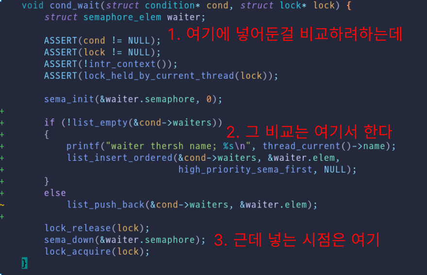

## how to test?


```bash
  cd /workspace/threads/build/
  rm tests/threads/alarm-multiple.output
  make tests/threads/alarm-multiple.result
```

### test list

```
ls threads/build/tests/threads/ | grep result

alarm-multiple.result
alarm-negative.result
alarm-priority.result
alarm-simultaneous.result
alarm-single.result
alarm-zero.result
priority-change.result
priority-condvar.result
priority-donate-chain.result
priority-donate-lower.result
priority-donate-multiple2.result
priority-donate-multiple.result
priority-donate-nest.result
priority-donate-one.result
priority-donate-sema.result
priority-fifo.result
priority-preempt.result
priority-sema.result
```


## test history

- [x] priority-change
- [x] alarm-priority
- [x] priority-preempt
- [x] priority-fifo
  - `lock_acquire`, `lock_release` 이놈들을 해결 해야 해
- [x] priority-sema
- [x] priority-condvar
  

- [c] priority-donate-one
- [c] priority-donate-multiple
- [c] priority-donate-multiple2
- [c] priority-donate-nest
- [c] priority-donate-sema
- [c] priority-donate-lower
- [c] priority-donate-chain


## donation 이해하기(with ai)


> [!lg] Log 2025-11-14 (금) 18:49
>
> 나에겐 시간이 부족했따... ㅠㅠ


- [x] priority-donate-one
- [x] priority-donate-multiple
- [x] priority-donate-lower
- [x] priority-donate-nest
- [x] priority-donate-multiple2
- [x] priority-donate-chain
- [x] priority-donate-sema


### 구현 순서

| 순서 | 테스트 | 난이도 | 필요 구현 |
|------|--------|--------|----------|
| 1 | donate-one | ⭐⭐ | 단일 기부 |
| 2 | donate-multiple | ⭐⭐⭐ | 다중 기부 + 회수 |
| 3 | donate-lower | ⭐⭐⭐ | 기본 우선순위 추적 |
| 4 | donate-nest | ⭐⭐⭐⭐ | 연쇄 기부 구현 |
| 5 | donate-multiple2 | ⭐⭐⭐ | 회수 순서 처리 |
| 6 | donate-chain | ⭐⭐⭐⭐⭐ | 깊은 연쇄 처리 |
| 7 | donate-sema | ⭐⭐⭐⭐ | 세마포어 통합 |


#### Phase 1: 기본 우선순위 기부

1. **priority-donate-one** ← 가장 단순, 기본 기부 메커니즘 학습
2. **priority-donate-multiple** ← 2개 락, 2개 기부 처리

#### Phase 2: 우선순위 회수 및 취소

3. **priority-donate-lower** ← 기부 받은 상태에서 기본 우선순위 변경

#### Phase 3: 연쇄 기부

4. **priority-donate-nest** ← 2단계 연쇄 기부 (H→M→L)
5. **priority-donate-multiple2** ← 3개 쓰레드, 2개 락, 비대칭 해제

#### Phase 4: 심화

6. **priority-donate-chain** ← 8단계 연쇄 기부
7. **priority-donate-sema** ← 세마포어 통합


